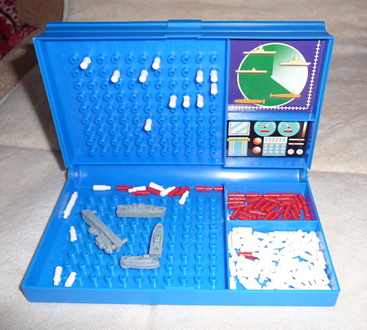
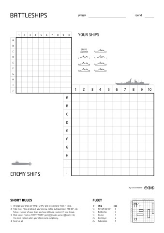
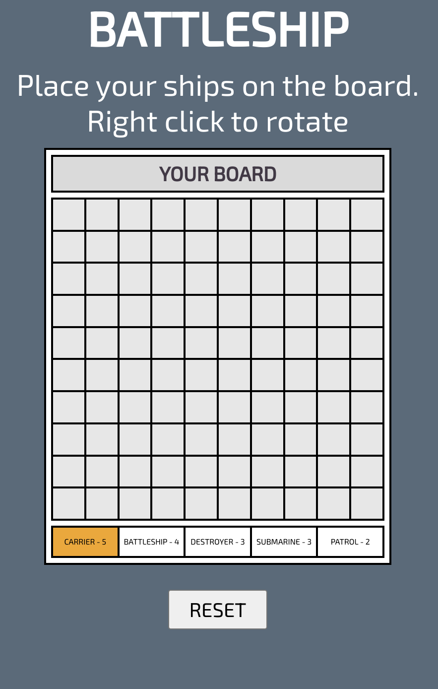
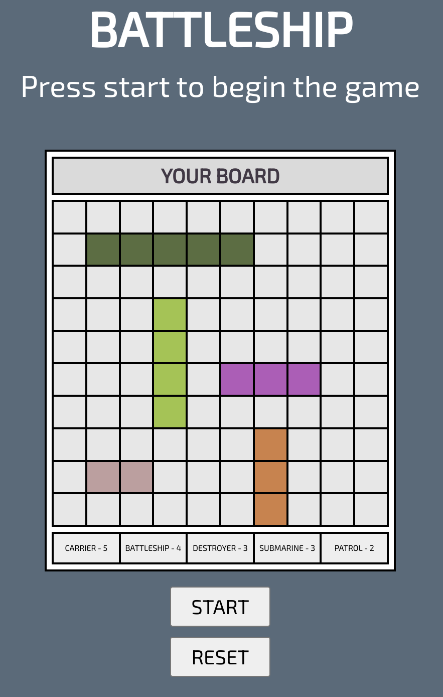
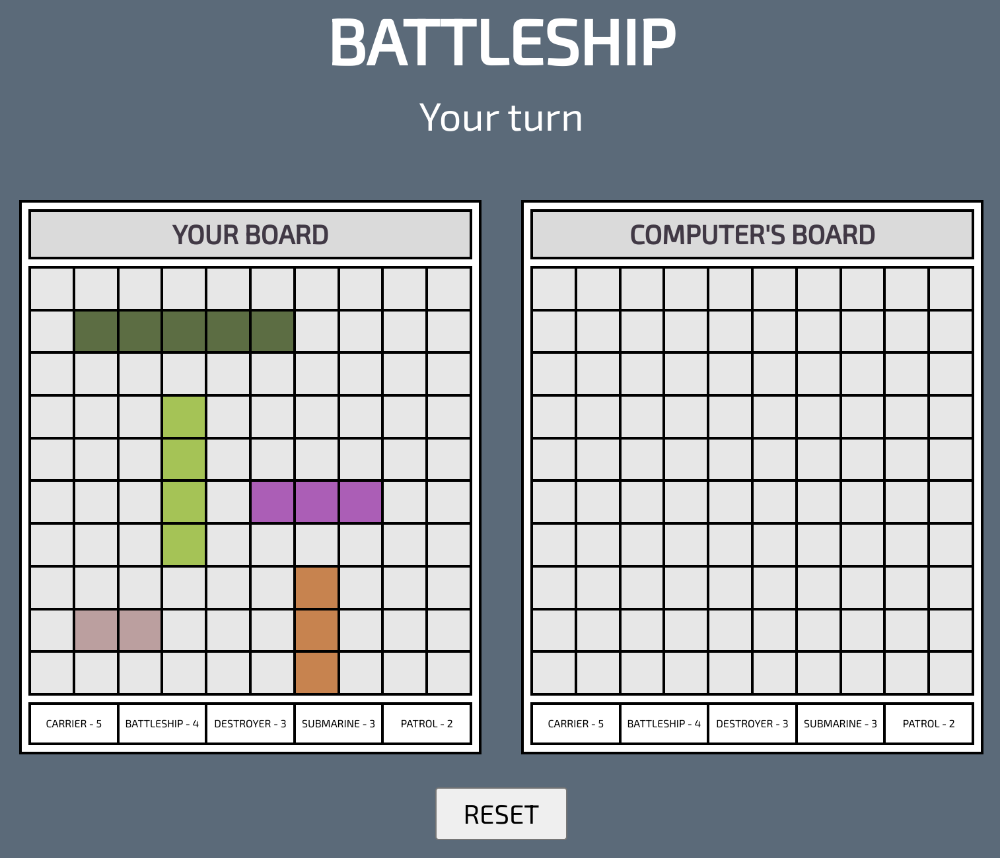
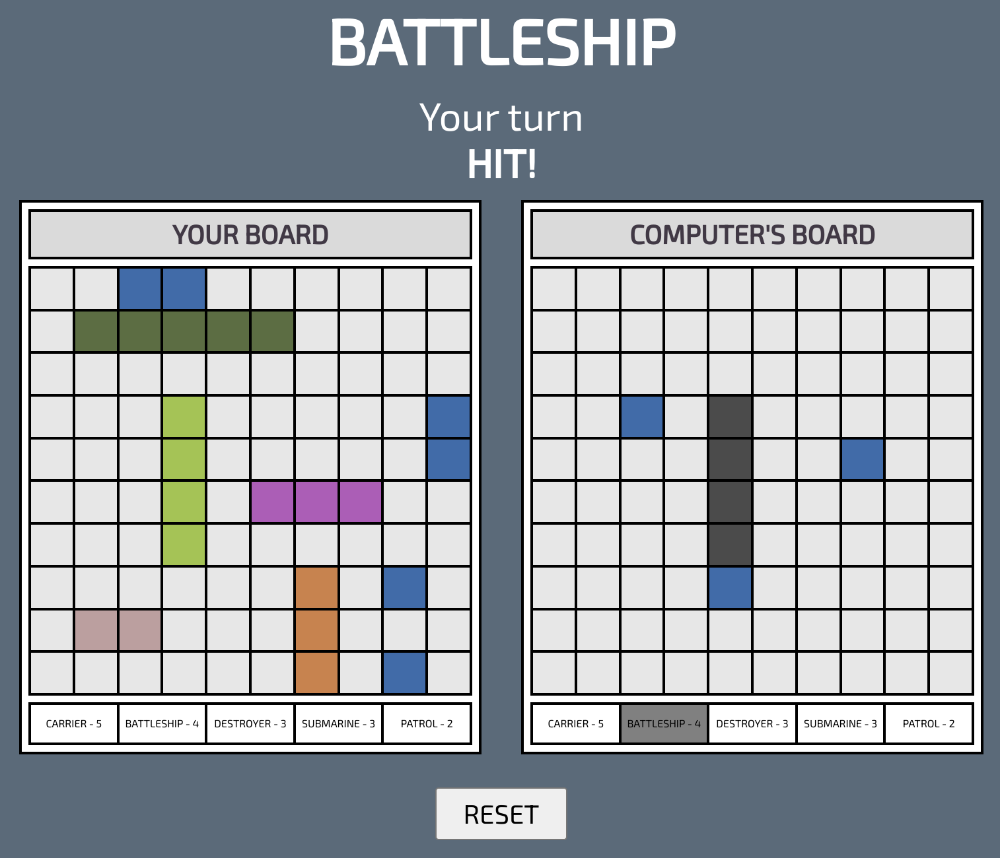
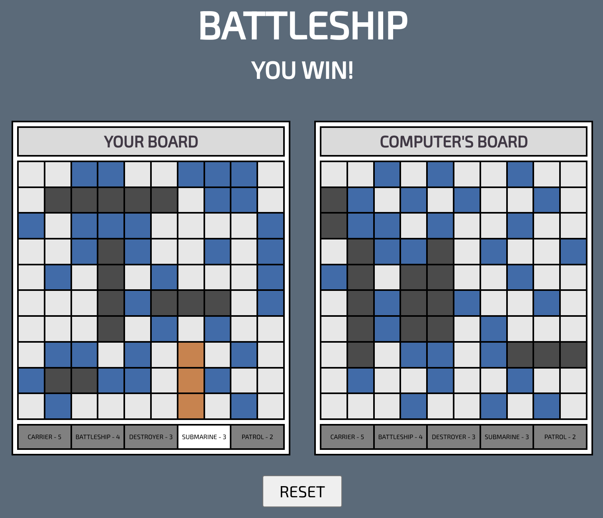

# Battleship Game

Battleship is a classic two-player strategic board game that simulates naval warfare.
The objective of the game is to locate and sink all of your opponent's ships before they do the same to yours.

<section>

By <a href="//commons.wikimedia.org/wiki/User:Sevela.p" title="User:Sevela.p">Pavel Ševela</a>, <a href="https://creativecommons.org/licenses/by-sa/3.0" title="Creative Commons Attribution-Share Alike 3.0">CC BY-SA 3.0</a>, <a href="https://commons.wikimedia.org/w/index.php?curid=18331432">Link</a>

By <a href="//commons.wikimedia.org/w/index.php?title=User:Sbednar&amp;amp;action=edit&amp;amp;redlink=1" class="new" title="User:Sbednar (page does not exist)">Sbednar</a> - Own work, <a href="https://creativecommons.org/licenses/by-sa/3.0" title="Creative Commons Attribution-Share Alike 3.0">CC BY-SA 3.0</a>, <a href="https://commons.wikimedia.org/w/index.php?curid=15488396">Link</a>

</section>

## Getting Started

[Click here](https://dominicspinks.github.io/Battleship/) to play Battleships for yourself.

Battleship Instructions:

-   Begin by placing each ship in your grid.
    -   You can rotate your ship with a right click (tap and hold for mobile).
    -   If you change your mind, hit the reset button to start over.
-   The computer's ships will be placed automatically
-   Once all ships are placed, hit the start button to begin
    -   You will go first, select a cell in the computer's board to make your shot.
    -   If it is a hit, try to sink the ship in your next turn.
    -   The computer will take its turn next.
-   Play continues until one player has sunk all of their opponents ships

## Screenshots

Ship placement pages: 
 
 
 
Player to start guessing: 

 
 
Sinking a ship: 

 
 
End of game: 

## Technologies Used

-   HTML
-   CSS
-   JavaScript

## Next Steps

Future enhancements for the game:

-   Add support for "Salvo's" rules
    -   This allows the player to make multiple guesses simultaneously, depending on the number ships remaining
-   Add scoring to track winners over multiple games
-   Add animations to the hit and miss events
-   Improve AI guessing and ship placements
-   Add difficulty options to control the AI's guessing strategy
-   Optimise for mobile
-   Render ships in the cells instead of colours
